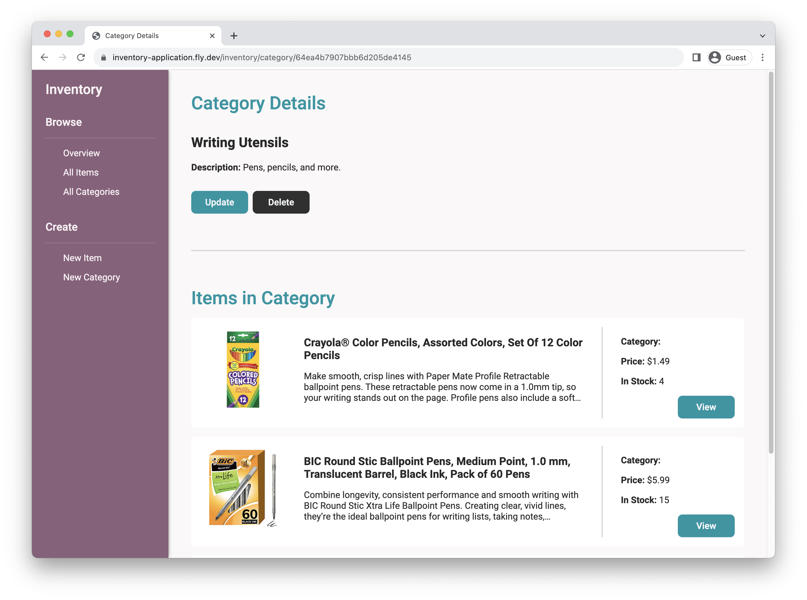

# Inventory Application

Basic inventory app to practice performing CRUD operations, using a database to store data, and working with forms.

## Technologies Used

- [Node.js](https://nodejs.org/en)
- [Express.js](https://expressjs.com/)
- [MongoDB](https://www.mongodb.com/)
- [EJS](https://ejs.co/) (templating language)
- [Multer](https://www.npmjs.com/package/multer) (for uploading files)
- [Fly.io](fly.io) (for deployment)

## Setup Instructions

1. Install dependencies using `npm install`
2. Use `npm run serverstart` to start dev server with automatic restarts upon change (using [nodemon](https://www.npmjs.com/package/nodemon)). Access in your browser at `localhost:3000/`.
